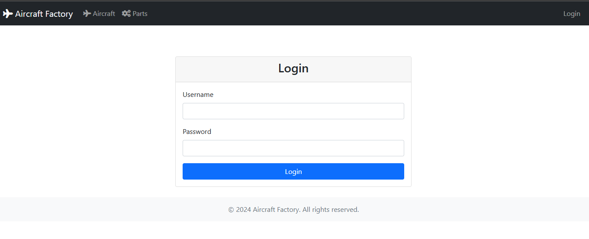
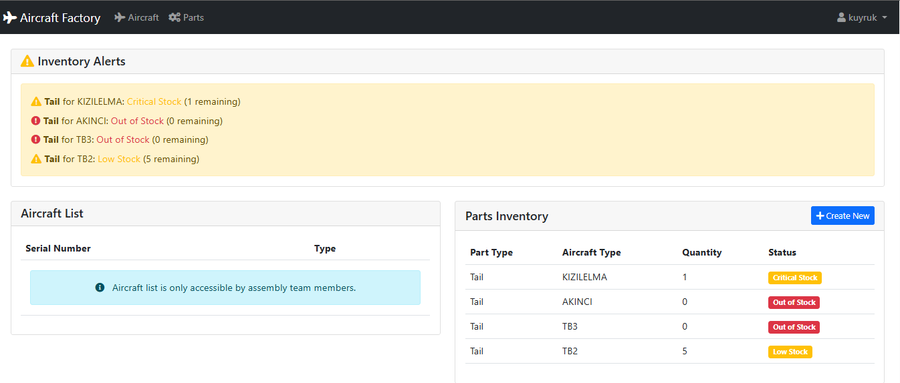
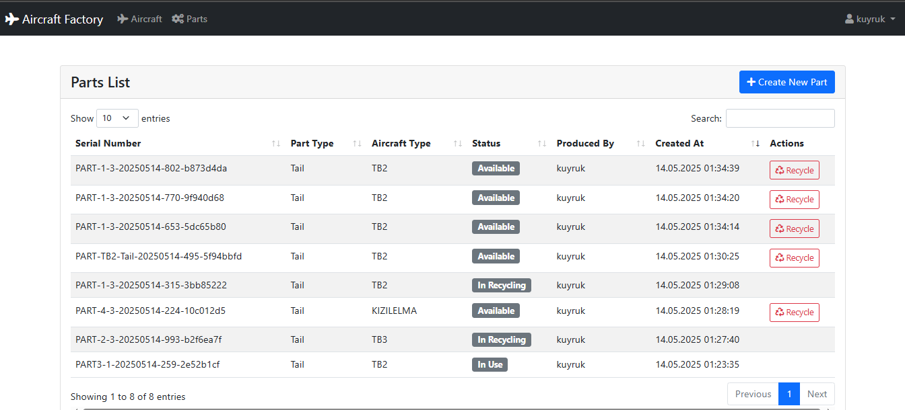
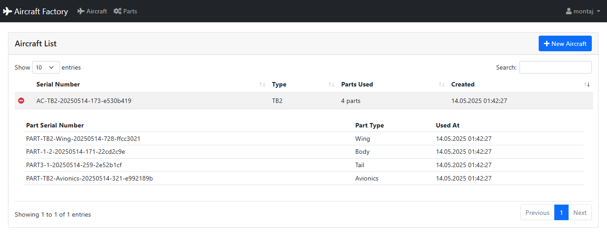
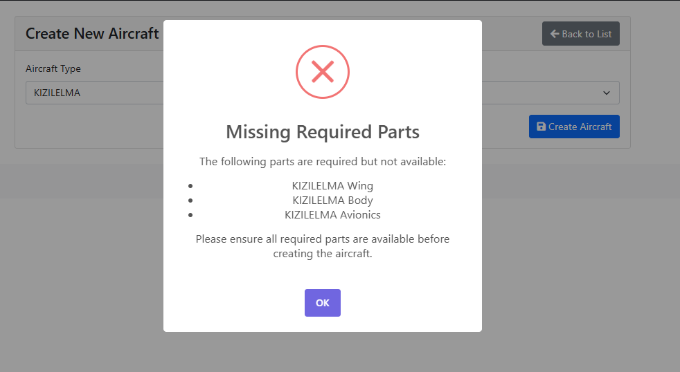

# Hava Aracı Üretim Uygulaması

Bu proje, uçak parçaları ve uçak üretim süreçlerinin yönetimi için geliştirilmiş bir web uygulamasıdır.

## 📌 İçindekiler
- [Özellikler](#-özellikler)
- [Ekran Görüntüleri](#-ekran-görüntüleri)
- [Teknolojiler](#-teknolojiler)
- [Kurulum](#-kurulum)
  - [Ortam Değişkenleri](#ortam-değişkenleri)
  - [Docker ile Kurulum](#docker-ile-kurulum)
  - [Manuel Kurulum](#manuel-kurulum)
- [Testler](#-testler)
- [API Dokümantasyonu](#-api-dokümantasyonu)

## 🚀 Özellikler

### 👥 Personel ve Takım Yönetimi
- Personel giriş sistemi
- Takım bazlı personel organizasyonu
- Bir takımda birden fazla personel bulunabilme

### 🔧 Parça Yönetimi
- Takımların kendi sorumluluklarındaki parçaları üretme, listeleme ve geri dönüşüme gönderme (CRUD) işlemleri
- Takım yetki kontrolü (Örn: Aviyonik takımı sadece kendi sorumluluğundaki parçaları üretebilir)
- Her parçanın hangi uçak modeline ait olduğunun kontrolü (Örn: A kanadı B'de kullanılamaz)
- Parça stok takibi ve envanter yönetimi

### ✈️ Uçak Montaj Sistemi
- Montaj takımının uyumlu parçaları birleştirerek uçak üretimi
- Üretilen uçakların listelenmesi
- Eksik parça durumunda uyarı sistemi (Örn: A için gövde parçası eksik uyarısı)
- Kullanılan parçaların stoktan otomatik düşümü
- Parçaların hangi uçakta kullanıldığının takibi

### 📊 Envanter Takibi
- Parça stok durumu kontrolü
- Kullanılan parçaların sayısal takibi
- Hangi parçanın hangi uçakta kullanıldığının kaydı

## 📸 Ekran Görüntüleri







## 🛠 Teknolojiler

- Python 
- Django
- Django REST Framework
- PostgreSQL
- HTML/CSS/JavaScript
- Bootstrap
- SweetAlert2

## ⚙️ Kurulum

### Ortam Değişkenleri

Projeyi çalıştırmadan önce `.env` dosyası oluşturmanız gerekmektedir. Proje ana dizininde `.env.example` dosyasından faydalanabilirsiniz.

### Docker ile Kurulum

1. Docker ve Docker Compose'u yükleyin
2. Projeyi klonlayın:
```bash
git clone <repo-url>
cd aircraft-factory
```

3. `.env` dosyasını oluşturun (yukarıdaki Ortam Değişkenleri bölümüne bakın)

4. Docker container'ları başlatın:
```bash
docker-compose up --build
```

5. Tarayıcınızda `http://localhost:8000` adresine gidin

### Manuel Kurulum

1. Python 3.8+ yükleyin
2. Projeyi klonlayın:
```bash
git clone <repo-url>
cd aircraft-factory
```

3. Sanal ortam oluşturun ve aktif edin:
```bash
python -m venv venv
# Windows için
venv\Scripts\activate
# Linux/Mac için
source venv/bin/activate
```

4. Gereksinimleri yükleyin:
```bash
pip install -r requirements.txt
```

5. Veritabanı migrasyonlarını yapın:
```bash
python manage.py makemigrations
python manage.py migrate
```

6. Geliştirme sunucusunu başlatın:
```bash
python manage.py runserver
```

7. Tarayıcınızda `http://localhost:8000` adresine gidin


## 🧪 Testler

Projede yazılan testleri çalıştırmak için aşağıdaki komutları kullanabilirsiniz:

### Tüm Testleri Çalıştırma
```bash
python manage.py test
```


## 📚 API Dokümantasyonu

Projede API dokümantasyonu için Swagger/OpenAPI kullanılmıştır.
